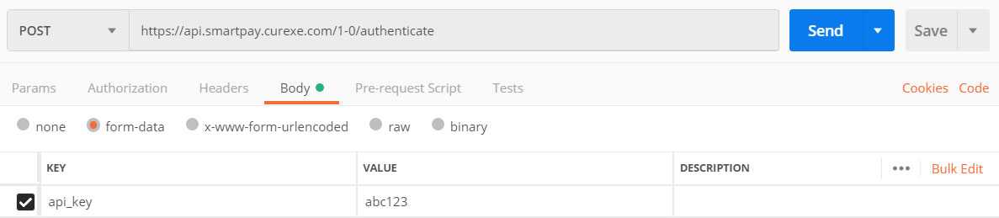
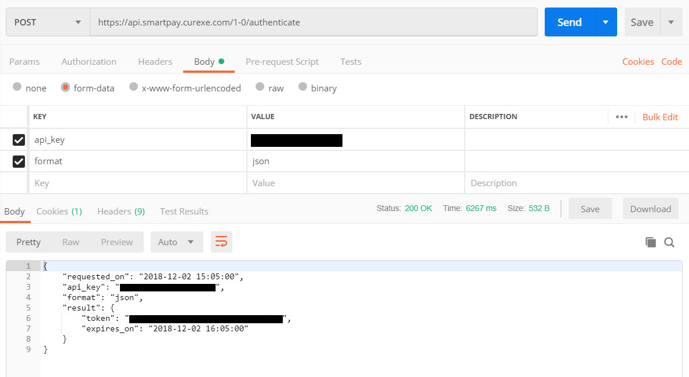
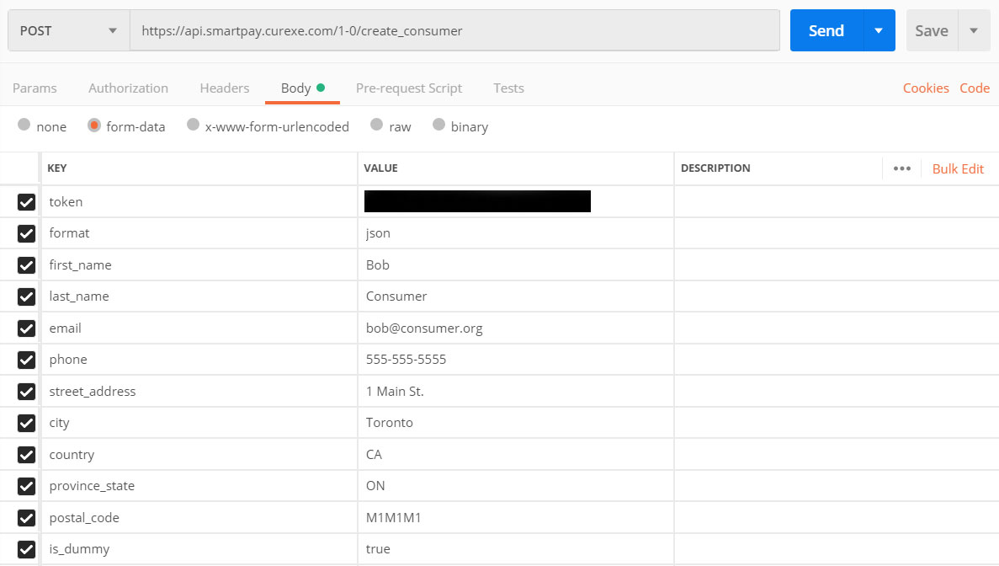
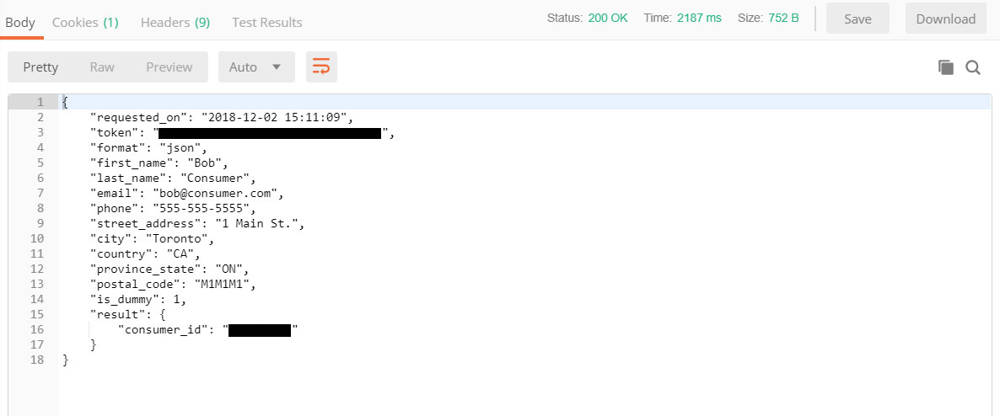

# Quick Start Guide

This tutorial has been written for users unfamiliar with how to integrate with an external API. If this information is too rudimentary, you're encouraged to skip ahead and read the full API documentation, from which this tutorial has been adapted.

## Before we begin

* You must first obtain an API key from the SmartPay website -- you'll need to be logged in to do this.

* Download [Postman](https://www.getpostman.com) or some other software tool for querying the API.

Your private API key identifies you as a unique user of the SmartPay API. Please keep it secret -- don't share it, don't email it, and don't embed it in browser-viewable code. If you ever believe your API key has been compromised, you can assign yourself a new one, but when you do this you'll need to update any integration code you've written.

Use of the API is monitored. This means that if you query the API too many times, or too often, the API will shut you down, and if you continue to hammer our server with superfluous requests, your account will be disabled.

# How it works

Querying the API is a two-step process.

The first step is an authentication handshake in which you send us your API key and we send you back a session token (a random string of characters) that you can use for the next hour or so in lieu of continually sending us your API token. Minimizing the transit of your API token across the Internet reduces the chances of third-party interception.

The second step is the actual query itself, in which you connect to one of our endpoints, send us your session token and some input parameters, and we return a resultset. For those new to APIs, endpoints can be thought of as specific URLs which returns results. All endpoints have the same URL structure:

https://api.smartpay.curexe.com/1-0/authenticate

You'll notice the URL contains both a version number ("1-0") and the endpoint ("authenticate"). For a list of all endpoints, consult the full API documentation, but for the purposes of this tutorial, we'll be using the /authenticate and /create_consumer endpoints.

# Authenticating

Configure Postman as follows. You'll obviously want to substitute your own API key for “abc123”.

Postman will then return the following result:

The returned token is your session token and is good for an hour, which should be more than enough time to query whatever data you need. If your session token does expire, you can simply reauthenticate to obtain a new one.

Note that any results returned from the API may include warnings and/or errors. Warnings won't impede results, but errors will. A complete list of warning and error codes is available at https://smartpay.curexe.com/api_error_codes.

When writing integration code, it's imperative that you be responsive to errors and warnings, since continuing to generate error states can result in your account being disabled. In particular, be alert to warnings that the version of the API you're using is approaching retirement.

# The Query

Now that you have a session token, it's time to query some actual data from the API. Configure Postman as follows. Note that the token below is the session token that was returned to you during authentication.

Postman will then return the following result:

In this case, the API has returned an ID for the consumer you've just created. This ID will remain a unique identifier for this consumer and can be used to modify or delete the consumer in the future.

# The importance of IDs

Consumers, orders and invoices use IDs for uniqueness. These IDs are valuable for determining whether you've already consumed a piece of content through the API, and thus can help ensure that you're only downloading the freshest data.

IDs are also valuable for modifying data. For example, consumer IDs obtained from the /get_consumers endpoint can be used with the /modify_consumer endpoint to change a consumer's email or postal address.

# Final thoughts

Now that you've successfully connected to the API, you're ready to begin your own integration using code generated by Postman or your own custom code.

The full API documentation on GitHub will help answer additional questions not addressed in this tutorial.
