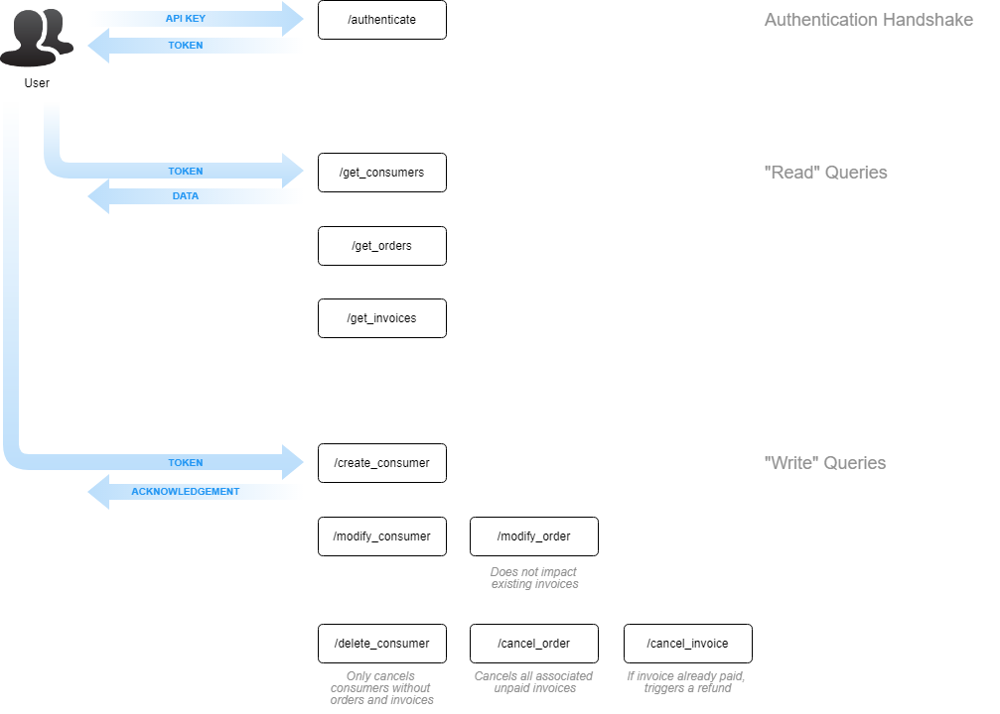

# API v1.1

## Overview

## Endpoints

### Authentication

- [authenticate](authenticate.md)

### Consumers

- [/get_consumers](get_consumers.md)
- [/create_consumer](create_consumer.md)
- [/modify_consumer](modify_consumer.md)
- [/delete_consumer](delete_consumer.md)

### Orders

Orders are the outcome of a consumer shopping experience, and will always result in one or more invoices depending on whether the order stipulates a one-time purchase or multiple recurring purchases.

- [/get_orders](get_orders.md)
- [/modify_order](modify_order.md)
- [/cancel_order](cancel_order.md)

### Invoices

Invoices are generated from orders, and can be thought of as payments. An invoice amount is received from the consumer, transfered to SmartPay, and then remitted post-adjustment to the retailer.

- [/get_invoices](get_invoices.md)
- [/cancel_invoice](cancel_invoice.md)

## Changelog

- Addition of payment_method as an input parameter and resultset attribute for orders and invoices
